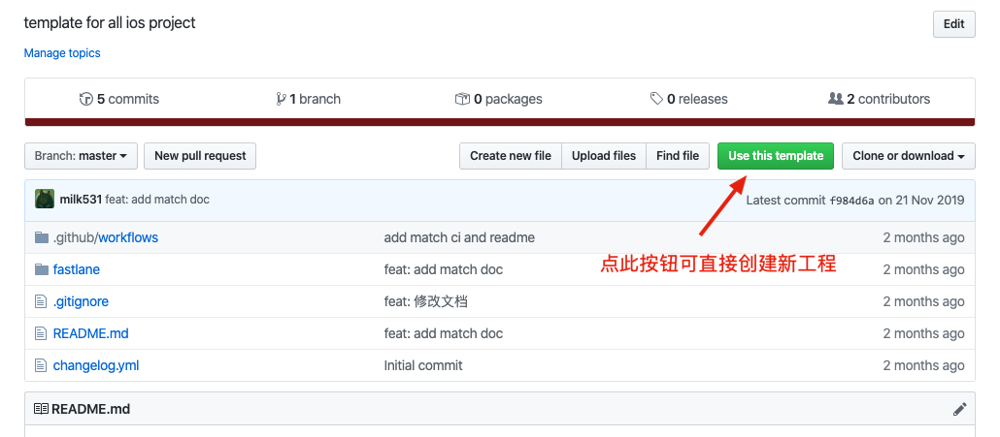

# Project


> 使用统一的`.gitignore`初始文件，可从本模板里复制过去

# AtlasXV/setup-linked-repo@v1
如果项目中需要检出其他依赖仓库，可以使用此action，详见 https://github.com/AtlasXV/setup-linked-repo 请参考设置。

# Fastlane

> **每个工程第一次都需要安装fastlane plugin，安装命令如下：**

```
fastlane install_plugins
```
> **XCode项目设置注意：**
如果依赖match管理codesign，请注意运行sync_code_signing导入appstore和adhoc的证书和provisioning profiles后，在项目中对其设置manually sign,并选择正确的profiles。开发环境可仍然使用Automatically manage signing。请使用configuration配置正确的构建配置。


预置了常用的3个发布操作

> - adhoc     - ota测试（目前测试阶段使用的方式）
> - beta      - TestFlight测试，测试完可直接进行AppStore发布（目前发布阶段使用的方式）
> - store     - 先打出AppStore包发布到ota平台，然后再择机发布到AppStore（可能的使用场景是苹果processing特别慢，然后需要托管到ota平台自动重试发布的时候）

请根据项目修改配置文件

> - Appfile       - 修改`app_identifier`，如果工程在不同账号下需要修改`team_id`,`itc_team_id`
> - Fastfile      - 修改`workspace_file`和`scheme_name`即可,如果证书的match库在不同账号下，需要修改`match_url`
> - .github/workflows/adhoc.yml     - 如果证书的match库在不同账号下，修改AtlasXV/setup-linked-repo@v1步骤的`linked_repository`

发布版本的时候将本次发布log置于`changelog.yml`中，脚本会每次读取最上方的配置作为本次发布的内容，可以保留每次发布的changelog内容在列表中，以便回顾更改概要。

# Github Action
默认使用self-hosted 机器进行打包，如果需要使用托管机器请自行修改
https://github.com/AtlasXV/ios-template/blob/280600d054743eaea8f347b8066f9fe50cd62779/.github/workflows/adhoc.yml#L22
