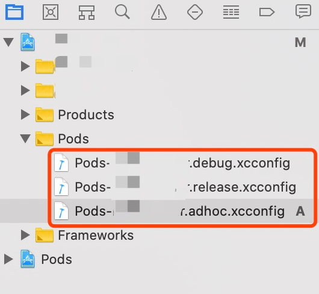
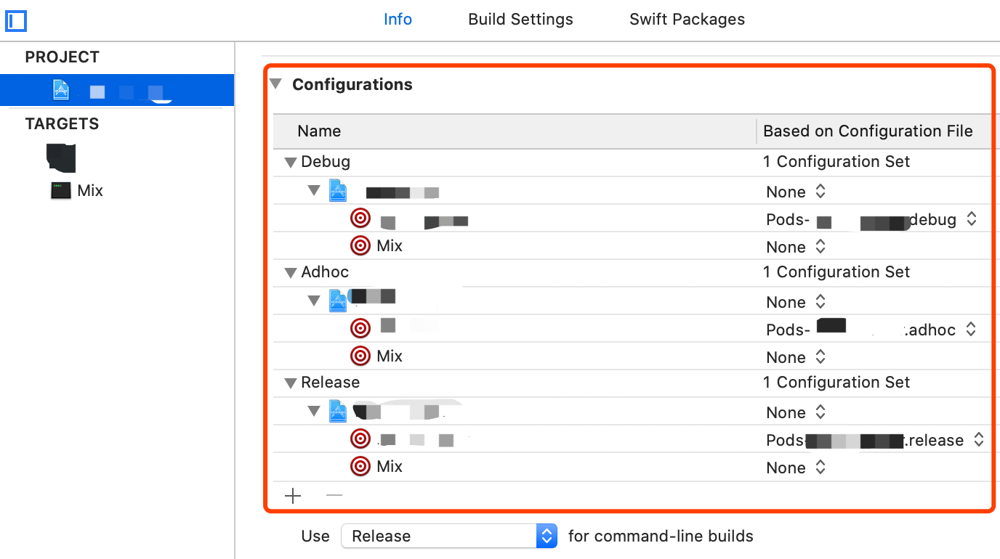
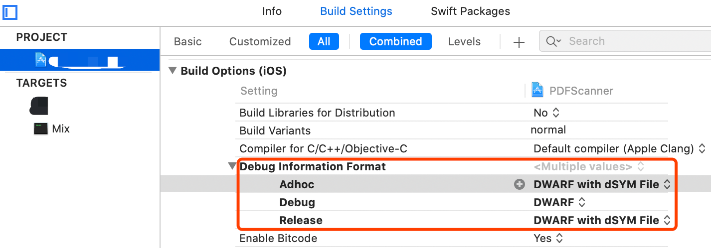
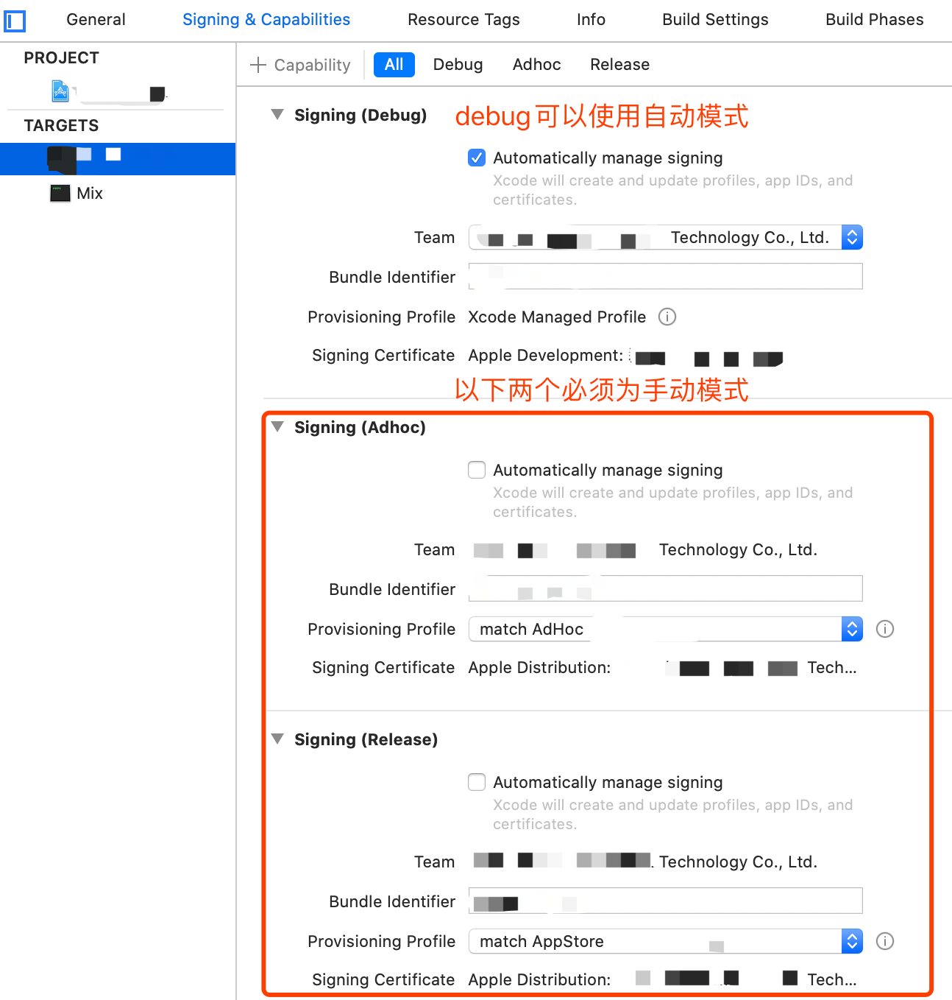
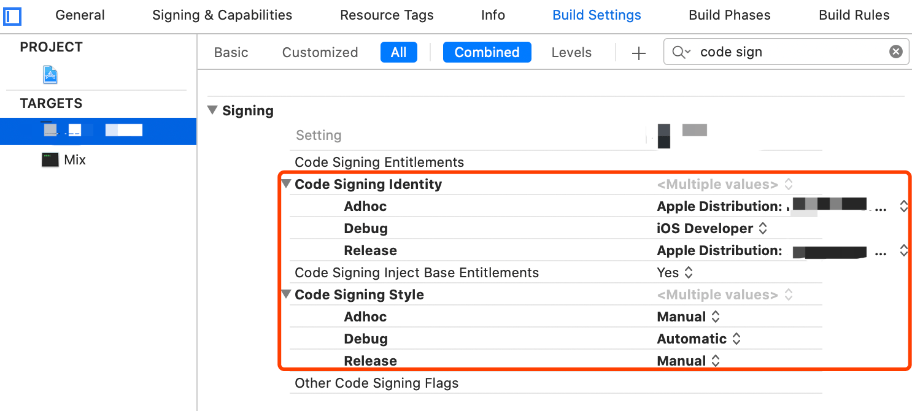

# 使用fastlane实现本机自动打包
## Setup fastlane
官方文档: [https://docs.fastlane.tools/getting-started/ios/setup](https://docs.fastlane.tools/getting-started/ios/setup)

##### 1. 安装Xcode命令行工具 (可忽略, 一般会跟随Xcode自动安装或更新)
```swift
xcode-select --install
```
##### 2. 安装fastlane, 以下命令二选一
```swift
# Using RubyGems
sudo gem install fastlane -NV

# Alternatively using Homebrew
brew install fastlane
```
##### 3. 进入到iOS项目的工程目录, 初始化fastlane. 例如: 
```swift
cd /Users/qwer/abcdefg_iOS

# 如果是纯OC或混编的工程
fastlane init
# 如果是Swift工程. fastlane仍将此标为(Beta)
# fastlane init swift
```

## Setup match
使用match来自动管理和同步证书, 详见官方文档: [https://docs.fastlane.tools/actions/match](https://docs.fastlane.tools/actions/match)
##### 1. match, alias for the sync_code_signing action
```swift
fastlane match init
```
##### 2. 在Matchfile中的添加配置信息, 最好不要添加账号密码等私密信息
```swift
# Matchfile文件

# 专门用来存储certificates 和 profiles的git项目, 如果没有则需要新建一个
git_url("https://github.com/fastlane/certificates")

storage_mode("git")

app_identifier(["tools.fastlane.app"])

# 如果你的Apple ID加入了多个开发者组织, 首次运行fastlane match development时, 会提示选哪个组织, 复制当前项目所属组织的teamId到此即可
team_id("123456789X")
```
##### 3. 在Appfile中的添加配置信息
```swift
# Appfile文件

team_id("123456789X")
```
##### 4. 此时, fastlane已初步配置完成, 可以先push一个commit, 再进行下一步.
##### 5. 首次在git上存储证书和描述文件时, 需要用管理员权限的Apple ID才行. 
因此得让有管理员权限的人, 在最新commit上分别跑一次以下命令, 以保存证书和描述文件:
```swift
fastlane match development

fastlane match adhoc

fastlane match appstore
```
上述命令运行期间, 会提示输入一个Passphrase for Match storage, 请管理员输入一串随机密码(让猫踩几下键盘), 并妥善保存.
##### 6. 此时macth功能已初步完成, 运行以下脚本正常即可:
```swift
# Fastlane文件

lane :test do
  match(type: "adhoc", readonly: true)
end
```
##### 7. 添加测试设备
```swift
# Fastlane文件

lane :test do
  register_devices(devices_file: "./devices.txt")
  match(type: "adhoc", force_for_new_devices: true)
end
```
## 检查项目的Xcode工程配置
使用match, 对应的工程配置要做出调整, 以便在新的电脑或无交互的CI机器中打包
##### 1. 项目工程中必须有三个.xconfig文件, 如下图. 一般会默认有Pods-xxxx-debug.xconfig和Pods-xxxx-release.xconfig两个文件, 如果adhoc的文件也已有, 请跳过第2 3步, 直接看第4步.

##### 2. 如果需要新创建到PROJECT -> Info -> Configurations -> "+" -> Duplicate "Debug" Configuration -> 改名Adhoc

##### 3. 重新Pod install

##### 4. 检查你的PROJECT -> info -> Configurations是正确的配置, 如下图

##### 5. 检查你的PROJECT -> Build Settings -> Debug Information Format是正确的配置, 如下图

##### 6. 检查你的TARGERS -> Signing & Capabilities 是正确的配置, 如下图

##### 7. 检查你的TARGERS -> Build Settings, 搜索code sign 是正确的配置, 如下图

## build and archive
更多参数和功能请, 参考官方文档: [https://docs.fastlane.tools/actions/gym/#parameters](https://docs.fastlane.tools/actions/gym/#parameters)
##### 1. 将此项目中的[./fastlane/Fastfile](https://github.com/AtlasXV/ios-template/blob/master/fastlane/Fastfile)文件, 复制并替换到你的项目中, 并修改对应的配置信息
##### 2. 尝试在本机上运行
```swift
fastlane adhoc

fastlane beta
```
##### 3. 一般本机第一次运行不一定会顺利成功, 不同的库和项目配置可能会导致各种编译错误. 请看命令行的错误提示, 调试解决.
##### 4. 本地跑通后, 再[使用Github Actions运行CI任务](https://github.com/AtlasXV/ios-template/blob/master/Usage/Usage_2_Actions.md)
