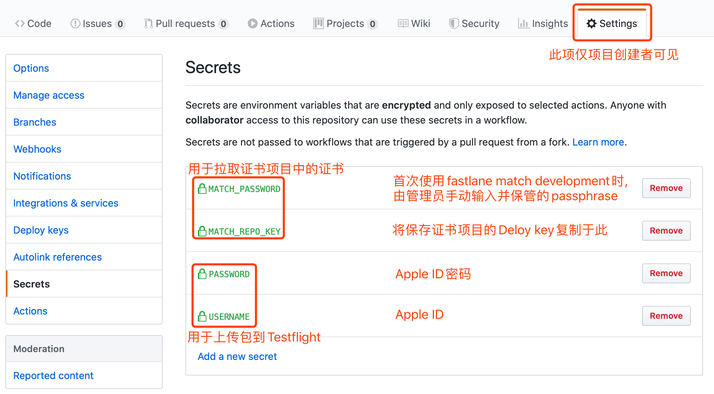

## 使用Github Actions运行CI任务
Actions官方文档: [https://help.github.com/en/actions](https://help.github.com/en/actions)

Actions轮子: [https://github.com/marketplace/actions](https://github.com/marketplace/actions)
##### 1. 初始化Actions: 将此项目拉到本地, 将隐藏文件夹.github完整复制到你的项目中即可.
##### 2. 请查看[.github/workflows/adhoc.yml](https://github.com/AtlasXV/ios-template/blob/master/.github/workflows/adhoc.yml)中的注释, 了解CI流程
##### 3. 设置账户认证所需的信息, 如下图所示

##### 4. 请在[使用fastlane本机自动打包](https://github.com/AtlasXV/ios-template/blob/master/Usage/Usage_1_Fastlane.md)成功后, 再修改changelog.yml或releaselog.yml尝试CI任务
